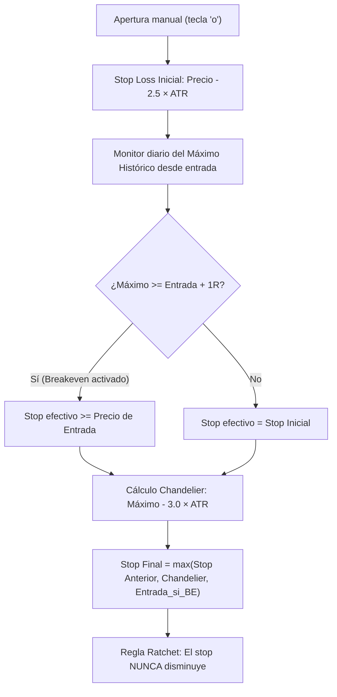

# Finanzas TUI — Scanner Cuantitativo & Dashboard de Trading

> **Aplicación de terminal (TUI)** de alto rendimiento en Python para escaneo técnico, auditoría cuantitativa de acciones y criptomonedas, gestión dinámica de posiciones (*trailing stop* y *breakeven*) y seguimiento de rendimiento en tiempo real.

Construida sobre [Textual](https://textual.textualize.io/) y [Rich](https://rich.readthedocs.io/) con la paleta de color **Tokyo Night**, integrando datos en directo a través de Yahoo Finance (`yfinance`), base de datos SQLite y soporte para alertas multicanal.

---

## Índice

- [Características Principales](#-características-principales)
- [Arquitectura del Proyecto](#-arquitectura-del-proyecto)
- [Estrategia Cuantitativa](#-estrategia-cuantitativa)
  - [Régimen de Mercado (SPY)](#1-régimen-de-mercado-spy)
  - [Los 8 Filtros Técnicos](#2-los-8-filtros-técnicos)
  - [Clasificación de Señales y Score](#3-clasificación-de-señales-y-score)
  - [Gestión de Posición: Breakeven y Chandelier Trailing Stop](#4-gestión-de-posición-breakeven-y-chandelier-trailing-stop)
  - [Dimensionamiento (*Sizing*) y Control de Exposición](#5-dimensionamiento-sizing-y-control-de-exposición)
- [Interfaz TUI y Atajos de Teclado](#-interfaz-tui-y-atajos-de-teclado)
- [Instalación y Uso](#-instalación-y-uso)
  - [Requisitos](#requisitos)
  - [Instalación Rápida](#instalación-rápida)
  - [Ejecutar el Scanner](#ejecutar-el-scanner)
- [Configuración (`config.json` y Entorno)](#-configuración-configjson-y-entorno)
- [Alertas y Notificaciones](#-alertas-y-notificaciones)
- [Motor de Backtesting (`backtest.py`)](#-motor-de-backtesting-backtestpy)
  - [Comparativa de Costes: ING Broker Naranja vs Interactive Brokers](#comparativa-de-costes-ing-broker-naranja-vs-interactive-brokers)
- [Batería de Tests](#-batería-de-tests)
- [Estructura de Datos y Persistencia](#-estructura-de-datos-y-persistencia)

---

## 🚀 Características Principales

- **Dashboard TUI Moderno**: Interfaz de terminal reactiva con actualización asíncrona en segundo plano cada 5 minutos (o bajo demanda), sin congelar la interfaz de usuario.
- **Filtro de Mercado Integrado**: Clasificación en tiempo real del régimen de mercado del S&P 500 (`SPY`) para filtrar entradas según la salud macro del mercado.
- **Auditoría Técnica de 8 Factores**: Score cuantitativo (0 a 8) evaluando medias móviles, distancia a la EMA8, RSI Wilder, volumen relativo institucional, tendencia semanal multi-temporal, ADX y fuerza relativa (RS) frente al SPY.
- **Gestión Avanzada de Posición**:
  - Stop Loss inicial basado en volatilidad real (2.5 × ATR).
  - Activación automática de **Breakeven** al alcanzar +1R de beneficio.
  - **Chandelier Trailing Stop** (3.0 × ATR desde el máximo histórico alcanzado).
  - Mecanismo *Ratchet*: el stop loss efectivo solo sube, garantizando la preservación de ganancias.
- **Control de Riesgo y Capital**: Cálculo automático de unidades a comprar según el riesgo monetario definido por operación (acciones enteras truncadas para renta variable, fraccional de 4 decimales para criptoactivos). Límite de exposición global con advertencias visuales en el panel.
- **Journal de Trading Integrado**:
  - Registro de órdenes en SQLite (`signals.db`) con resolución automática de desenlaces (*WIN*, *LOSS*, *EXPIRED*).
  - Cuaderno de bitácora para operaciones reales cerradas (`journal.json`), con estadísticas agregadas en directo: *Win Rate*, R promedio ganadoras/perdedoras y *Expectancy* matemática.
- **Copia Rápida de Órdenes**: Copia nativa al portapapeles del sistema del plan completo de la orden en un solo toque (`c`) listo para pegar en el bróker.
- **Alertas Multicanal**: Despacho automático de nuevas señales a través de **Telegram**, **Discord Webhooks** y notificaciones de escritorio de Linux (`notify-send`).
- **Motor de Backtesting Homogéneo**: Simulación histórica día a día utilizando exactamente el mismo código y fórmulas que el scanner en vivo, con modelado realista de comisiones y spread FX para brokers (ING vs IBKR).

---

## 📂 Arquitectura del Proyecto

```
finanzas-tui/
├── app.py                     # Aplicación principal Textual (TUI, tablas, modales y workers)
├── strategy.py                # Lógica matemática pura de indicadores, filtros y salidas
├── strategy_config.py         # Carga y validación de configuración (config.json + variables de entorno)
├── positions.py               # Persistencia y gestión de posiciones abiertas (positions.json)
├── trade_journal.py           # Journal de trades reales cerrados y cálculo de métricas (journal.json)
├── journal.py                 # Histórico de señales y resolución de desenlaces en SQLite (signals.db)
├── alerts.py                  # Despacho de notificaciones a Telegram, Discord y escritorio
├── backtest.py                # Motor de simulación histórica día a día con costes reales
├── backtest_results.json      # Resultados estructurados del último backtest ejecutado
├── config.json                # Parámetros cuantitativos y credenciales de alertas
├── tickers.json               # Lista activa de seguimiento (watchlist por defecto)
├── tickers_etf_test.json      # Universo de prueba para ETFs sectoriales
├── tickers_growth_test.json   # Universo de prueba para valores de crecimiento
├── positions.json             # Registro persistente de posiciones abiertas
├── positions_backups/         # Backups automáticos de seguridad con rotación (máx. 20)
├── journal.json               # Historial de operaciones cerradas
├── signals.db                 # Base de datos SQLite para auditoría de señales
├── tests/                     # Suite completa de tests unitarios (85 tests)
│   ├── conftest.py            # Fixtures de aislamiento para tests
│   ├── test_strategy.py       # Cobertura de cálculos técnicos y filtros
│   ├── test_positions.py      # Cobertura de seguridad y gestión de posiciones
│   ├── test_trade_journal.py  # Cobertura de cálculos de métricas y journal
│   └── test_backtest_trailing.py # Cobertura del motor de backtest sin look-ahead
└── AGENTS.md                  # Reglas del entorno de desarrollo
```

---

## 📊 Estrategia Cuantitativa

### 1. Régimen de Mercado (SPY)

Antes de validar señales individuales, el sistema evalúa la tendencia general del mercado analizando el ETF `SPY` (S&P 500):

| Régimen | Condición Técnica | Comportamiento del Scanner |
|---|---|---|
| **BULLISH** | Precio > SMA200 y Precio > SMA50 | Habilita señales estándar `● ENTRADA LARGO`. |
| **PULLBACK** | Precio > SMA200 y Precio ≤ SMA50 | Genera señales de menor convicción `◐ ENTRADA DÉBIL`. |
| **BEARISH** | Precio ≤ SMA200 | Bloquea aperturas; marca señales técnicas como `○ ESPERA SPY`. |

### 2. Los 8 Filtros Técnicos

Cada ticker en la lista de seguimiento es evaluado contra 8 condiciones rigurosas:

1. **`c_sma` (Tendencia a Largo Plazo)**: Precio > SMA200 diario.
2. **`c_ema` (Momento a Corto Plazo)**: Precio > EMA8 diario.
3. **`c_dist` (Control de Extensión)**: Distancia a EMA8 ≤ 1.5% (`(Cierre - EMA8) / EMA8 * 100`). Evita comprar activos sobreextendidos.
4. **`c_rsi` (RSI Saludable)**: 45.0 ≤ RSI(14) ≤ 65.0 (suavizado Wilder). Exige fuerza pero descarta sobrecompra extrema.
5. **`c_vol` (Confirmación de Volumen)**: Volumen / Vol_SMA20 ≥ 1.2x. Asegura interés institucional en la sesión.
6. **`c_weekly` (Filtro Multi-Timeframe)**: Cierre semanal > SMA200 semanal, con pendiente positiva en las últimas 4 semanas.
7. **`c_adx` (Fuerza de Tendencia)**: ADX(14) ≥ 20.0. Descarta activos en rangos laterales sin dirección.
8. **`c_rs` (Fuerza Relativa vs SPY)**: Diferencia de rendimiento porcentual vs SPY en 20 sesiones ≥ 0.0%. Solo se compran valores que baten o igualan al índice.

### 3. Clasificación de Señales y Score

- **Score Numérico (0 a 8)**: Representa cuántos de los 8 filtros técnicos se cumplen simultáneamente.
  - `7 - 8`: Verde (`#9ece6a`) — Setup de alta calidad técnica.
  - `5 - 6`: Ámbar (`#e0af68`) — Setup en desarrollo.
  - `0 - 4`: Gris neutro (`#565f89`) — Sin tracción técnica.
- **Tipos de Señal**:
  - `● ENTRADA LARGO`: 8/8 filtros superados y SPY Bullish.
  - `◐ ENTRADA DÉBIL`: 8/8 filtros superados pero SPY en Pullback.
  - `○ ESPERA SPY`: 8/8 filtros técnicos superados, pero bloqueado por SPY bajista.
  - `○ ESPERA`: Menos de 8 filtros superados.

### 4. Gestión de Posición: Breakeven y Chandelier Trailing Stop

A diferencia de los sistemas tradicionales con salidas fijas rígidas, la estrategia implementa una gestión dinámica adaptada a la volatilidad:



- **Stop Inicial**: Entrada - 2.5 × ATR(14). Proporciona holgura suficiente para no ser expulsado por ruido normal de mercado.
- **Breakeven (+1R)**: Si el máximo alcanzado supera Entrada + Riesgo Inicial, el stop se eleva como mínimo al precio exacto de entrada.
- **Chandelier Trailing**: Máximo Histórico - 3.0 × ATR(14). Permite capturar grandes tendencias alcistas sin limitar artificialmente el potencial de beneficio (*let winners run*).
- **Mecanismo Ratchet**: En cada sesión o refresco, el nuevo nivel de stop calculado es max(Candidato, Stop Previo). El nivel de salida garantizado jamás retrocede.

### 5. Dimensionamiento (*Sizing*) y Control de Exposición

Para mantener un riesgo simétrico en cada operación:

```text
Riesgo por Unidad = Precio de Entrada - Stop Loss
Unidades          = Riesgo por Operación / Riesgo por Unidad
```

- **Acciones**: Truncadas a enteros (N ≥ 1 acción). Si el riesgo por unidad excede el capital asignado, muestra `0 acc (Riesgo insuficiente)`.
- **Criptoactivos**: Fraccional a 4 decimales para activos con paridad `USD` (ej. `BTC-USD`).
- **Control de Exposición Global**: Suma del capital total invertido en posiciones activas. Si supera el tope configurado (`exposure_cap`, default 8.000 USD), el dashboard muestra una alerta visual amarilla en el panel superior.

---

## 🖥 Interfaz TUI y Atajos de Teclado

La interfaz se divide en:
1. **Barra Superior**: Contadores de posiciones activas, exposición real vs. tope, estado del SPY, temporizador de refresco (5:00 min) y estado general.
2. **Caja de Entrada**: Permite escribir un ticker y agregarlo directamente pulsando `Enter`.
3. **Tabla Principal de Órdenes**: Lista ordenada automáticamente con prioridad a señales activas, score y volumen.
4. **Barra Lateral (Auditoría Técnica)**: Muestra en vivo la cotización, sparkline de precios, checklist de los 8 filtros y el plan de trading detallado de la fila seleccionada.
5. **Ventanas Modales**: Pantalla de auditoría técnica ampliada (`Enter`) y Cuaderno de Trading / Journal (`j`).

### ⌨️ Atajos de Teclado

| Tecla | Acción | Descripción |
|:---:|:---|:---|
| `q` | **Salir / Volver** | Sale de la aplicación o cierra cualquier modal abierto. |
| `r` | **Refrescar** | Lanza un escaneo forzado inmediato en segundo plano. |
| `f` | **Filtrar Señales** | Alterna entre mostrar toda la watchlist o solo las señales activas (`LONG`/`WEAK`). |
| `d` | **Borrar Ticker** | Elimina el ticker actualmente seleccionado de `tickers.json`. |
| `+` | **+25 USD Riesgo** | Incrementa en 25 USD el riesgo asignado por operación. |
| `-` | **-25 USD Riesgo** | Reduce en 25 USD el riesgo asignado por operación (mínimo 25 USD). |
| `c` | **Copiar Orden** | Copia al portapapeles el texto formateado de la orden listo para el bróker. |
| `o` | **Abrir Posición** | Registra manualmente la compra del valor seleccionado en `positions.json`. |
| `x` | **Cerrar Posición** | Cierra la posición activa, calcula el resultado (USD y R) y la añade a `journal.json`. |
| `j` | **Journal** | Abre el modal con las estadísticas agregadas y el historial de trades cerrados. |
| `Enter` | **Auditoría / Cerrar** | Abre el modal de auditoría técnica con sparkline ampliado de 60 barras (o cierra modales). |
| `Esc` | **Cerrar Modal** | Cierra cualquier modal abierto y regresa a la tabla principal. |

---

## 🛠 Instalación y Uso

### Requisitos

- Python 3.10 o superior (probado exhaustivamente en Python 3.12 y 3.14 en Linux).
- Conexión a internet para la descarga de cotizaciones mediante `yfinance`.
- Terminal compatible con color verdadero (24-bit / ANSI).

### Instalación Rápida

1. **Clonar el repositorio:**
   ```bash
   git clone https://github.com/HPosedev/TradingApp.git
   cd finanzas-tui
   ```

2. **Crear y activar un entorno virtual:**
   ```bash
   python3 -m venv .venv
   source .venv/bin/activate
   ```

3. **Instalar dependencias:**
   ```bash
   pip install textual rich yfinance pandas requests
   ```

### Ejecutar el Scanner

```bash
python3 app.py
```
*(o ejecutando directamente con el binario del entorno: `.venv/bin/python app.py`)*

---

## ⚙️ Configuración (`config.json` y Entorno)

La configuración se almacena en `config.json`. Si el archivo no existe, la aplicación lo genera automáticamente con los valores recomendados por defecto.

Los valores pueden sobreescribirse mediante **variables de entorno** (ideal para entornos de despliegue o para no comprometer claves secretas):

| Parámetro en `config.json` | Variable de Entorno | Default | Descripción |
|---|---|:---:|---|
| `risk_per_trade` | `RISK_PER_TRADE` | `100.0` | Riesgo monetario en dólares por operación. |
| `total_capital` | `TOTAL_CAPITAL` | `10000.0` | Capital nominal de la cuenta. |
| `exposure_cap` | `EXPOSURE_CAP` | `8000.0` | Límite máximo de capital invertido en posiciones activas. |
| `max_dist_ema8` | — | `1.5` | Distancia porcentual máxima permitida a la EMA8. |
| `min_rsi` | — | `45.0` | Umbral mínimo del RSI(14). |
| `max_rsi` | — | `65.0` | Umbral máximo del RSI(14). |
| `min_vol_ratio` | — | `1.2` | Ratio mínimo de volumen respecto a su media de 20 sesiones. |
| `adx_min` | — | `20.0` | Nivel mínimo de fuerza de tendencia (ADX). |
| `rs_min` | — | `0.0` | Mínimo diferencial de retorno porcentual respecto a SPY en 20 sesiones. |
| `require_spy_bullish`| `REQUIRE_SPY_BULLISH` | `true` | Exigir SPY alcista para generar señal `LONG`. |
| `require_weekly_trend`| `REQUIRE_WEEKLY_TREND` | `true` | Exigir tendencia semanal alcista (SMA200 semanal creciente). |
| `atr_sl_mult` | — | `2.5` | Multiplicador de ATR para el Stop Loss inicial. |
| `atr_trail_mult` | — | `3.0` | Multiplicador de ATR para el Chandelier Trailing Stop. |
| `journal_path` | `JOURNAL_PATH` | `signals.db` | Ruta del archivo de base de datos SQLite para señales. |
| `telegram_bot_token` | `TELEGRAM_BOT_TOKEN` | `""` | Token del bot de Telegram para alertas. |
| `telegram_chat_id` | `TELEGRAM_CHAT_ID` | `""` | ID del chat o canal de Telegram receptor. |
| `discord_webhook` | `DISCORD_WEBHOOK` | `""` | URL del Webhook de Discord para alertas. |

> **Prioridad de carga:** Variables de entorno > `config.json` > Valores predeterminados en código.

---

## 🔔 Alertas y Notificaciones

El módulo `alerts.py` opera de forma completamente desacoplada y asíncrona dentro del hilo worker del escáner:

- **Telegram**: Envía un mensaje con el formato de orden detallado tan pronto como se detecta una señal nueva en la sesión.
- **Discord**: Publica un mensaje enriquecido mediante Webhook.
- **Escritorio Linux**: Utiliza la utilidad nativa `notify-send` para mostrar notificaciones flotantes en el escritorio del usuario si está disponible en el sistema.

Las alertas se despachan únicamente cuando una señal es registrada por primera vez en `signals.db`, evitando mensajes repetidos o spam en cada ciclo de refresco.

---

## 📈 Motor de Backtesting (`backtest.py`)

El motor de simulación histórica ejecuta una réplica exacta de la operativa en vivo sobre datos diarios:
- **Sin sesgo de anticipación (*no look-ahead bias*)**: En cada día simulado D, solo se conocen los datos disponibles hasta D.
- **Gestión Chandelier & Breakeven**: Evalúa diariamente las salidas por trailing stop o breakeven utilizando la misma función `stop_with_breakeven`.

### Ejecución

```bash
# Backtest sobre la watchlist actual (tickers.json)
.venv/bin/python backtest.py

# Backtest sobre un universo predefinido (ej. ETFs o Crecimiento)
.venv/bin/python backtest.py --universe=etfs
.venv/bin/python backtest.py --universe=growth

# Backtest sobre tickers específicos
.venv/bin/python backtest.py AAPL NVDA MSFT AMZN
```

Los resultados detallados trade a trade se guardan automáticamente en `backtest_results.json`.

### Comparativa de Costes: ING Broker Naranja vs Interactive Brokers

El backtest incorpora un modelo de costes reales para analizar el impacto del intermediario en la esperanza matemática (*Expectancy* en R):

| Concepto | Broker Naranja (ING) | Interactive Brokers (IBKR) |
|---|---|---|
| **Comisión fija por orden** | 3,00 € | 0,00 USD |
| **Comisión variable** | 0,10% del importe (tope 20 €) | 0,005 USD por acción (mínimo 1,00 USD) |
| **Spread de divisa (FX)** | 0,50% en compra y 0,50% en venta | ~0,002% (interbancario) |

La salida del backtest imprime el resultado bruto junto al resultado neto para ambos brokers, demostrando el impacto directo de las comisiones y el tipo de cambio en estrategias de swing trading.

---

## 🧪 Batería de Tests

El proyecto cuenta con una cobertura integral de **85 tests unitarios** diseñados para verificar la consistencia matemática y la seguridad del sistema:

```bash
.venv/bin/python -m unittest discover -s tests
```

### Mecanismos de Protección en Tests
- **Aislamiento Estricto de Datos**: Los módulos `positions.py` y `trade_journal.py` cuentan con salvaguardas que detectan si se están ejecutando bajo un framework de test (`unittest` o `pytest`). Si un test intentara escribir en los ficheros reales de producción (`positions.json` o `journal.json`), el sistema aborta de inmediato lanzando `RuntimeError`.
- **Fixtures automáticas**: Redirigen las operaciones a archivos temporales aislados a través de las variables `FINANZAS_POSITIONS` y `FINANZAS_JOURNAL`.

---

## 💾 Estructura de Datos y Persistencia

- **`tickers.json`**: Lista de tickers bajo seguimiento.
- **`positions.json`**: Posiciones abiertas actualmente, con precio de entrada, fecha, stop inicial, stop actual, breakeven activado, unidades e importe invertido. Antes de cualquier modificación real, se genera automáticamente una copia de seguridad en el directorio `positions_backups/`.
- **`journal.json`**: Historial de posiciones cerradas manualmente (`x`) con cálculo de duración en días, resultado en USD y resultado en múltiplos de riesgo (R).
- **`signals.db`**: Base de datos SQLite que registra cada señal histórica detectada por el escáner y rastrea automáticamente si en las 60 sesiones posteriores la cotización alcanzó primero el objetivo o el stop.

---

## ⚠️ Descargo de Responsabilidad

*Esta aplicación y las estrategias cuantitativas implementadas tienen un propósito puramente educativo, analítico y de desarrollo de software. No constituyen asesoramiento financiero ni recomendaciones de inversión. El trading en mercados financieros conlleva riesgos significativos de pérdida patrimonial.*
